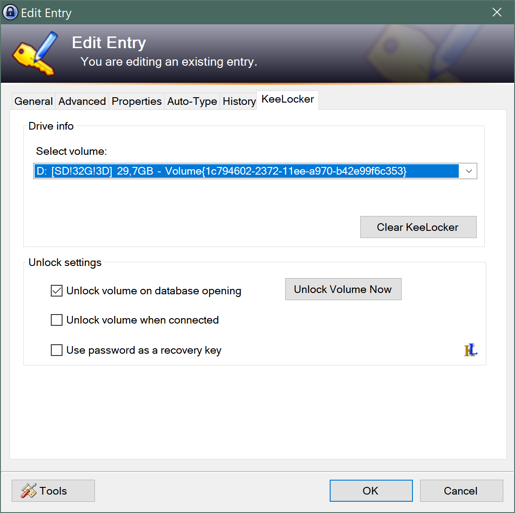

# KeeLocker
KeePass2 plugin to open BitLocker volumes when you open your KeePass database.

Should also work for USB sticks or portable drives.

## The feature

This plugin adds the following tab to entries :

## Breaking Changes

- Starting with KeeLocker 1.7 the defaults for unlocking on database opening and device connect are changed to disabled. Which means you have to reenable them if desired.

## How to use

If you have a static drive (let's say a HDD bound to "D:") encrypted with bitlocker, you should :

  -  create a new entry, choose a title you want
  -  put the password for the drive in the entry usual password field (if you have only a recovery key, please also check "Use password as a recovery key"
  -  Use `Select` and choose the entry starting with D: the volume in the KeeLocker tab (It shows drive letter and volume label and size if possible) or manually edit the `Drive mountpoint` (drive letter or folder) or `Drive GUID`
  
You can also tick one of the following the checkboxes
  
  - "Unlock volume on opening" which will do so when the Database is opened (but that requires to close then open the DB). Or you can click "Unlock Volume Now" to test it right now.
  - "Unlock volume when connected" which will unlock the volume when the device is connected 
  - "Use password as a recovery key" in case the password is a recovery key

## When should I use *Drive GUID* ?

In short: Always.

The *Drive GUID* avoids problems for removable devices and if the KeePass database is used on multiple computers.
USB sticks might get mounted to different drive letters on different computers or even on the same computer if the drive letter is occupied for something else.
Since 1.7 KeeLocker only attempts to unlock volumes that are enumerated on that system. This prevents spying on api calls, but is only effective if the drive guid is used.
