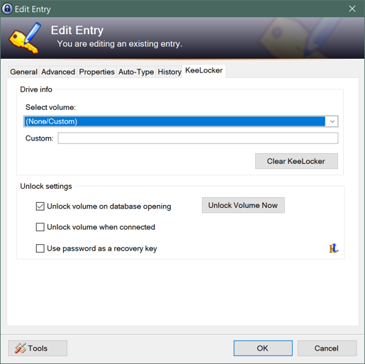
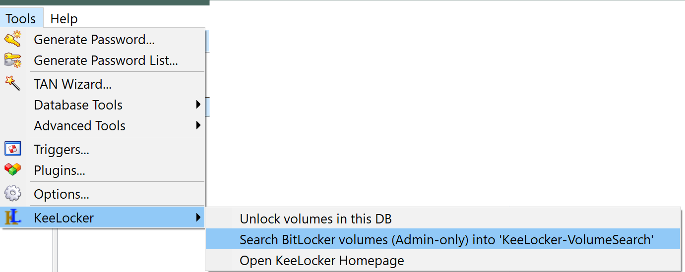

# Info - Important

This a fork of the original KeeLocker plugin [Gugli/KeeLocker](https://github.com/Gugli/KeeLocker).
It has updates changed to this repo, and changed author to make it distinguishable.

The home for this fork is [github.com/lexx9999/KeeLocker](https://github.com/lexx9999/KeeLocker)!

# KeeLocker
KeePass2 plugin to open BitLocker volumes when you open your KeePass database.

Should also work for USB sticks or portable drives.

## The features

### KeePass started as regular user

This plugin adds the following tab to entries:

If the volume (ake Drive/SSD/HDD/USB-Stick) is connected you can just select it from the dropdown:

Otherwise you have to select `(None/Custom)` and fill in the VolumeID (like `\\?\Volume{GUID}\`) or MountPoint (like `D:\` or `C:\MountDir\`) manually. It's recommened to create/update entries only for connected drives.

You can also tick one of the following the checkboxes
  
  - "Unlock volume on opening" which will do so when the Database is opened (but that requires to close then open the DB). Or you can click "Unlock Volume Now" to test it right now.
  - "Unlock volume when connected" which will unlock the volume when the device is connected 
  - "Use password as a recovery key" in case the password is a recovery key

The `Clear KeeLocker` button will remove fields starting with 'KeeLocker' from the advanced properties.

## KeePass started as Administrator - Scan BitLocker volumes

Preamble: You probably shouldn't run KeePass as Administrator in regular use!

Since this feature requires elevated privileages KeePass must be stared as Administrator to allow it. Otherwise you'll just get a notification indicating the requirement.

The scan creates or extends a group `KeeLocker-VolumeSearch` with new Entries for BitLocker volumes. 
If only recovery-key is defined it will put the recovery key in the password field.
If password is used it will reserve the password field for the password (or PIN), although you have to enter it manually!
In recovery-key and also password case the recovery-key is stored as protected field `RecoveryKey`. In this case it's assumed that you prefer to use the password.

Multiple scans will create multiple entries therefore housekeeping is recommended:
After the scan you should edit the title of entries you want to keep and move them to another group. And finally deleting the left over group.

## Breaking Changes

- Starting with KeeLocker 1.7 the defaults for unlocking on database opening and device connect are changed to disabled. Which means you have to reenable them if desired.
- Starting with KeeLocker 1.7.0.2 the MountPoint might be cleared if there is a volume id (GUID).
